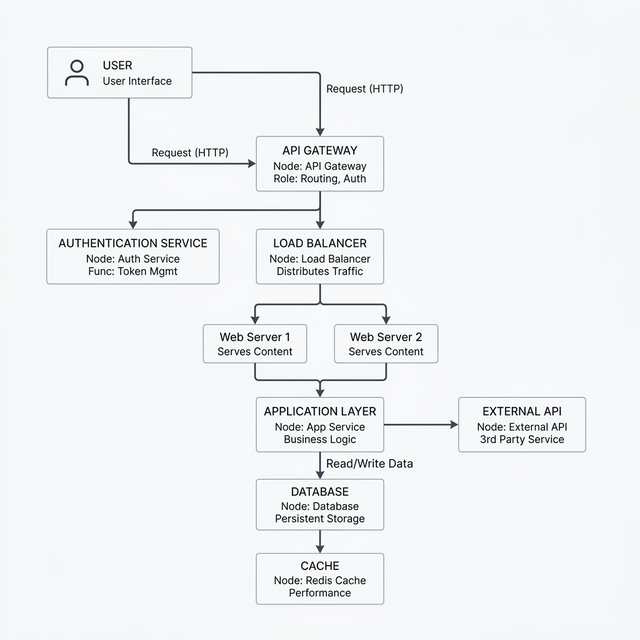
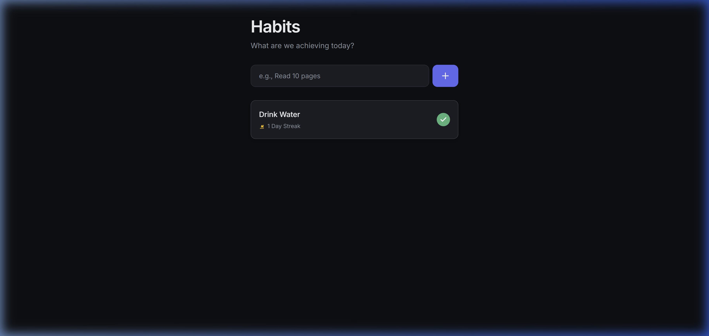

# Attractor Workflow Demo

A comprehensive demonstration of [StrongDM's Attractor](https://github.com/strongdm/attractor) AI pipeline workflow, seamlessly integrated with the [Antigravity](https://marketplace.visualstudio.com/items?itemName=AntimatterResearch.antigravity) coding agent. This project showcases how a directed-graph (DOT) pipeline can uniquely orchestrate multi-stage AI-assisted application development — traversing from requirements gathering through implementation, unit testing, and full browser end-to-end verification.

The demo application included in this repository is a **Minimalist Habit Tracker** built *entirely* by an AI agent following the Attractor pipeline strictly.

## What is the Attractor Workflow?

The [Attractor specification](https://github.com/strongdm/attractor) by StrongDM defines a paradigm where AI coding tasks are orchestrated using **Graphviz DOT syntax**. Instead of a continuous, potentially chaotic chat log, execution follows a deterministic graph:
- **Nodes** represent discrete tasks (e.g., generate code, run a test, pause for human review).
- **Edges** define the flow based on node outcomes (e.g., `success`, `error`, `Approve`, `Retry`).
- **Context** is passed cleanly from node to node, maintaining state across the pipeline.

### The Antigravity Implementation
This repository adapts that specification into a reusable workflow specifically for Antigravity, enhancing it with:
1. **Automatic pipeline generation** from natural language requirements via a custom embedded *Generator Skill*.
2. **Strict context tracking** with mandatory state updates written to `context.md` at each node transition.
3. **Internal Browser Validation** running true end-to-end (E2E) UI tests natively within the agent loop.
4. **Systematic Debugging** when tests fail. Rather than blindly retrying an implementation node, the agent is forced to step back and diagnose the error trace first.

### The Demo DOT Pipeline Flowchart

The following flowchart outlines the exact steps the Habit Tracker took from inception to completion. Notice the human-in-the-loop gates allowing the user to `Approve` or `Retry` code generations and implementation reviews.



```dot
start → research_requirements → review_requirements (human gate)
      → implement_storage → implement_ui
      → run_tests → run_browser_test
      → review_implementation (human gate)
      → generate_walkthrough → success
```

## The Habit Tracker App

The app built by the agent during our pipeline test is included in the `/app` directory.

### Features
- **Local-first Data**: All activity is stored in the browser's `localStorage` — completely private with no backend or accounts required.
- **Daily Check-ins & Streaks**: Mark habits as complete for today and automatically track consecutive day streaks.
- **Dark Mode UI**: Clean, minimalist interface with refined CSS micro-animations.
- **Accessible & Tested**: Semantic HTML, ARIA labels, and fully covered by Vitest unit tests.

### Screenshots


*The app after adding "Drink Water" and marking it complete via the browser E2E test agent, showing a 1 Day Streak.*

### Running the App Locally

```bash
cd app
npm install
npm run dev
# Then open http://localhost:8080 or the port specified
```

### Running Tests

```bash
cd app
npm test
```

## Project Structure

```
├── app/                         # The Habit Tracker application
│   ├── index.html               # Main HTML file
│   ├── style.css                # Dark-mode styling with animations
│   ├── script.js                # Core JS logic 
│   ├── test.test.ts             # Vitest unit tests
│   ├── vitest.config.ts         # Test runner configuration
│   └── package.json             # Dependencies and local dev scripts
│
├── attractor/                   # Pipeline artifacts from the demo run
│   ├── pipelines/
│   │   └── habit_tracker.dot    # The DOT pipeline definition (PII-scrubbed)
│   └── runs/
│       └── run_1/
│           └── context.md       # Final pipeline execution state tracking
│
├── workflow/                    # Reusable workflow + skill for Antigravity
│   ├── attractor-workflow.md    # The /attractor slash-command workflow definition
│   └── attractor-generator/
│       └── SKILL.md             # The skill that converts requirements to DOT
│
├── screenshots/                 # Flowcharts and UI captures
└── docs/
    └── requirements.md          # Generated AI requirements document
```

## How to Use the Workflow

To integrate this Attractor workflow into your own Antigravity local setup:

1. Copy `workflow/attractor-workflow.md` into your Antigravity workflows directory (e.g., `.agents/workflows/attractor.md`).
2. Copy the `workflow/attractor-generator/` directory into your skills directory (e.g., `.gemini/antigravity/skills/attractor-generator/`).
3. Inside Antigravity, invoke the workflow using the `/attractor` slash-command.
4. Describe your desired application. The generator skill will build a DOT pipeline and the workflow will manage the execution node-by-node.

## Lessons Learned in Integration

We discovered several crucial edge-cases while building the initial demo, leading to specific workflow improvements now included in this repository:

| Issue | Root Cause | Fix Applied |
|---|---|---|
| Tests failed immediately | `vitest` needed the `jsdom` module | Added explicit `init_test_environment` guidance to the generator skill to provision environments. |
| Missing UI verification | Pipeline defaults favored unit tests | Generator now injects a `run_browser_test` node specifically for web apps using the internal browser subagent. |
| Missing Dev Hook | The agent struggled finding a localhost port | Generator enforces a dev server script (e.g. `npm run dev`) must exist for E2E tasks. |
| Context drift | The agent forgot its pipeline state | Workflow rules strictly mandate logging state changes to `context.md` *before and after* each node runs. |
| Blind test retries | Agent got stuck guessing test syntax | Workflow intercepts `error` loops and enforces a `systematic_debugging` review before altering implementation code. |

## Credits

This project builds heavily on the **Attractor** specification created by [StrongDM](https://github.com/strongdm/attractor). Attractor defines the core concept of utilizing Graphviz graphs to maintain state and determinism across LLM coding tasks. 

- **StrongDM Attractor Repository**: [github.com/strongdm/attractor](https://github.com/strongdm/attractor)
- **Attractor Spec Diagram**: [attractor-spec.md](https://github.com/strongdm/attractor/blob/main/attractor-spec.md)
- **Agent Loop Methodology**: [coding-agent-loop-spec.md](https://github.com/strongdm/attractor/blob/main/coding-agent-loop-spec.md)

## License
MIT
